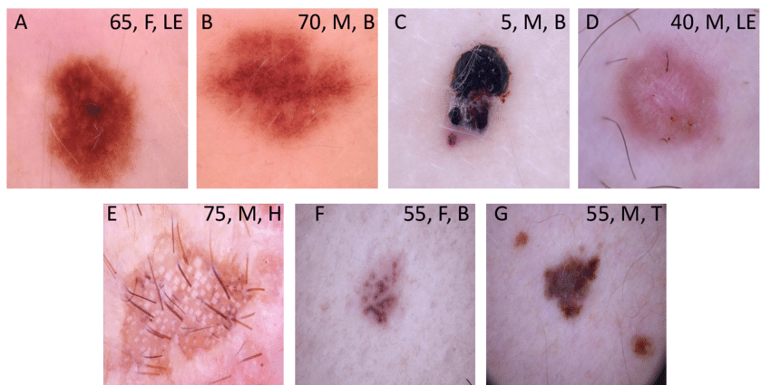
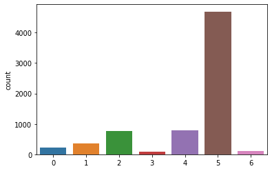

# HAM1000-Skin-Cancer
Classifying seven different skin lesions from HAM10000 dataset: Actinic keratoses, Basal cell carcinoma, Benign keratosis-like lesions, Dermatofibroma, Melanocytic Nevi, Vascular lesions, Melanoma 
 
 

 

As you see in the above picture, the dataset is Unbalanced and XGBoost can improve accuracy of datasets which are unbalanced. Therfore I have Used XGBoost combined with VGG.
Firstly I extract some features using VGG16 architecture and then I feed the features into XGBoost.
